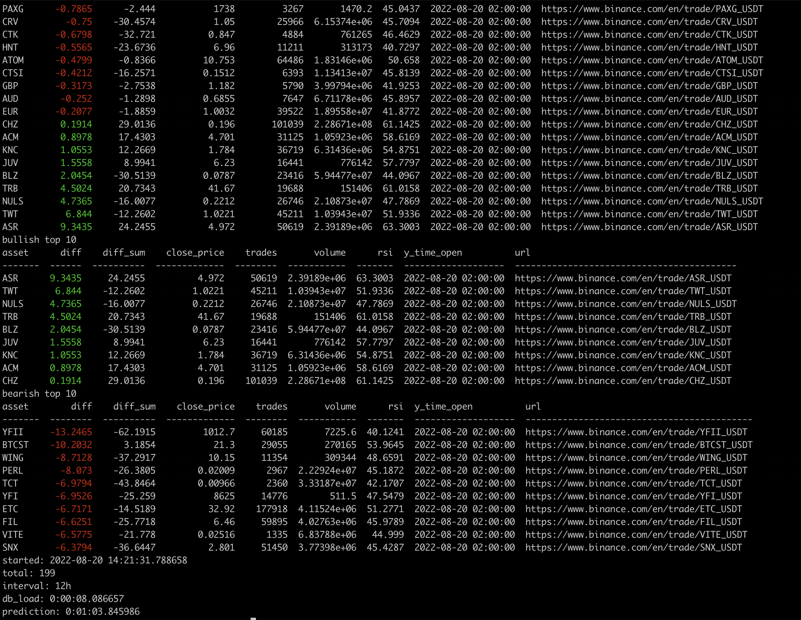
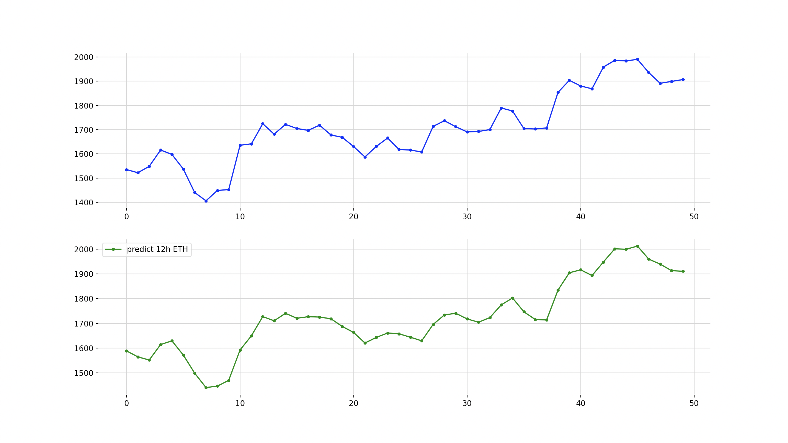

## Description


ohlc time series training and forecasting of close price with keras & tf2

### Installation

```
python -m venv .env
source .env/bin/activate

pip install -r requirements-mac.txt
pip install -r requirements-ubuntu.txt
pip install --force-reinstall -r requirements-mac.txt
```

Running application needs a database with the name `ta_dev`, as configured in `src/parameters.py`

```
psql -U postgres
create database ta_dev;
```

Once it's done sync db schema with the command, and after your good to go with predicting.

```
ENV=dev python db_flush_sync.py
```

## Prediction

In the current state of development models are trained to predict the closing price for ohlc pairs on `USDT` market.

### Predicting single shot

By running `model_predict.py` application fetches time data for 1000 passed intervals, and guesses the only single value
for next price . Available intervals: `5m, 15m, 30m, 1h, 2h, 4h, 8h, 12h, 1d, 3d`.
Smaller intervals are not well picked up by this type of prediction, `listen.py` to be used instead.

```
ENV=dev python predict.py 1h model/gru-g-50-1000-11-1m-BTCUSDT.keras
```



### Predicting realtime

Realtime prediction is build on top of binance websocket api that provides realtime data for the last timeframe used in
model, while the initial ohlc values are fetched though the http api which takes a couple of minutes. Downloading of
ohlc data from 300+ assets takes around two minutes, meaning `listen.py` should be started ahead. Available
intervals: `1m, 3m, 5m, 15m, 30m, ...`, listener also works on larger intervals.

```
ENV=dev python listen.py 5m model/gru-g-50-1000-11-1m-BTCUSDT.keras
```

### Training

I suggest having a separate database `ta_train` for prevention of spoiling training dataset.

Train your models with command `model_train.py`

```
ENV=train python db_flush_sync.py
ENV=train python db_populate.py

ENV=train python model_train.py
ENV=train python model_plot.py 1m model/gru-g-50-1000-11-1m-BTCUSDT.keras

```



### Testing

Same as with training, tests require `ta_test` db for prevention of spoiling training or dev databases.

```
psql -U postgres
create database ta_test;
``` 

Running tests

```
ENV=test python -m pytest test
ENV=test python -m pytest --log-cli-level DEBUG -s test/service/test_trader.py
ENV=test python -m pytest test/service/test_trader.py
ENV=test python -m pytest -s test/service/test_trader.py

```

### Binance API keys and secret (optional)

In some cases binance may reject anonymous requests, for solving these add your `api_key`, `api_secret` to the
environment to be read from klines service and library related.

open file with the editor of choice, ex `nano .env/bin/activate`, see https://stackoverflow.com/a/9554331
put your key in the end of the file

```
API_KEY="your key from binance here"
API_SECRET="your secret from binance"
export API_KEY
export API_SECRET
```

reactivate the environment with `source .env/bin/activate` so the keys would be picked up by the app.
